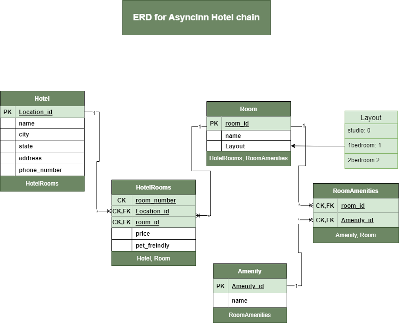
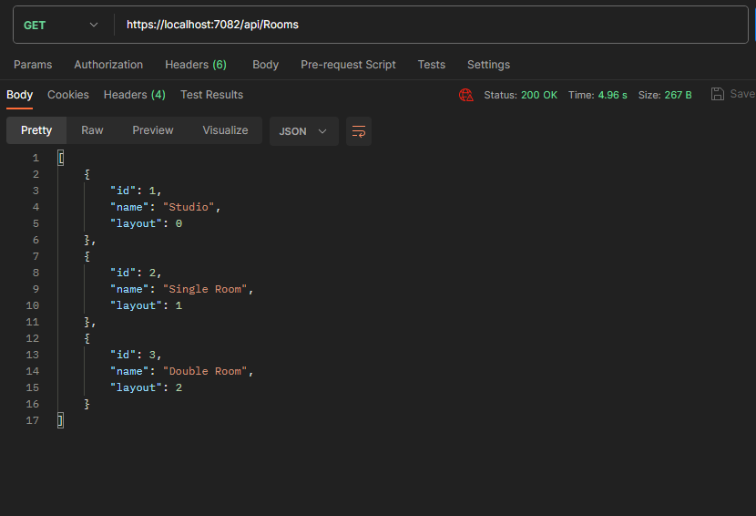
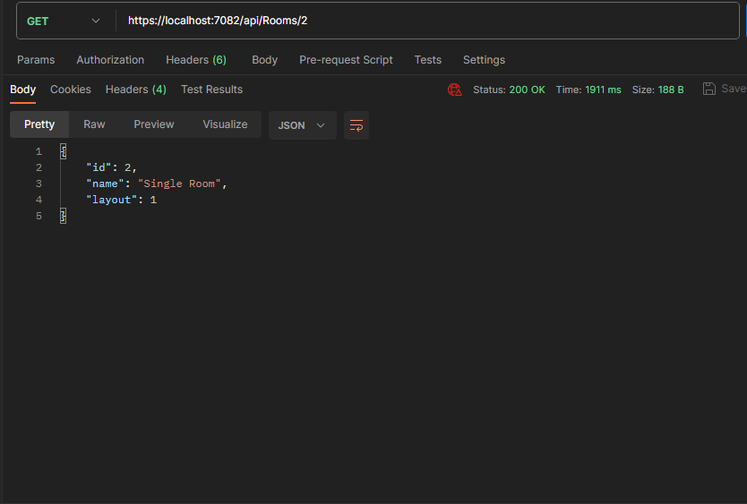
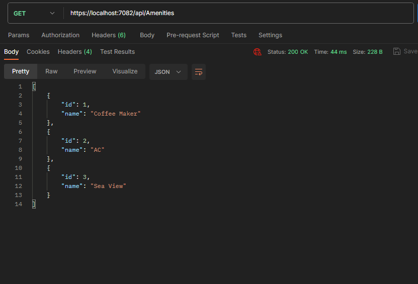
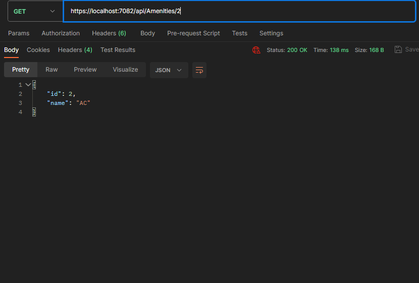
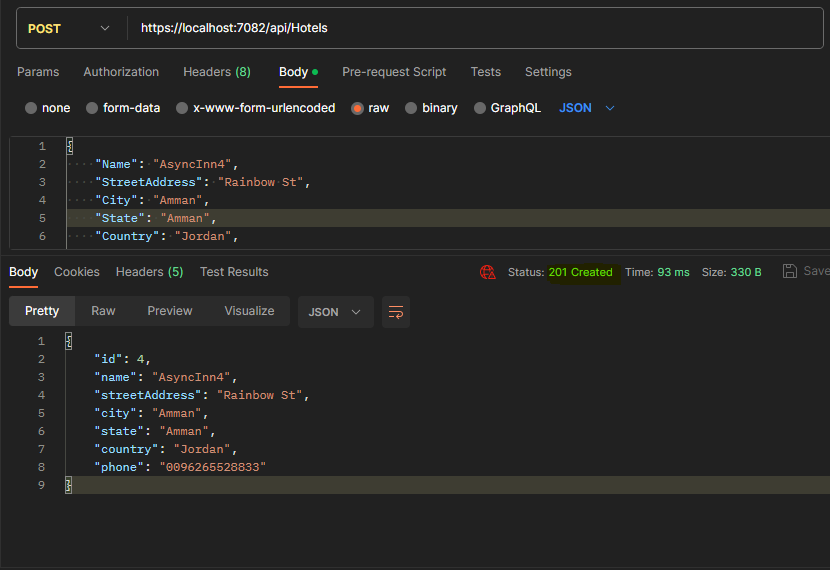
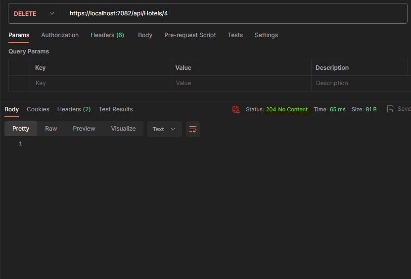

## Projec : API server for AsyncInn Hotel Asset Management System :house_with_garden:

### Author: Nadine Aleideh :cancer:

| Lab | Subject | Date     |
| --- |   ----    |  ---   |
| 11  | Databases and ERDs | 16/7/2023   |
| 12  | Intro to Entity Framework | 19/7/2023      |
| 13  | Dependency Injection | 23/7/2023      |

## Description

The Async Inn Hotel Asset Management System is a web-based API designed to help Async Inn, a local hotel chain, better manage their hotel assets across multiple locations. This project aims to provide a RESTful API server that allows the management of rooms, amenities, and new hotel locations. The system leverages a relational database to store and maintain the integrity of the data.

## ERD Diagram

Explanation of the Tables:

1. **Hotel**:
   - Represents each hotel location with its unique identifier, name, city, state, address, and phone number.
   - Attributes: location_id (PK), name, city, state, address, phone_number

2. **Room**:
   - Represents the room it self and has a room id , nickname and a layout Enum.
   - Attributes: room_id (PK), nickname.
   - The room has a relationship with two tables it is one to many with Rooms because this room is one room in many rooms in the hotel and many to many with amenities because many rooms can have many of amenities and many amenities, can be assigned for many rooms.

3. **HotelRooms**:
   - Joint entity table with payload between two tables and it is many to one with hotel and many to one with Room.
   - room number it's a composite key between the room id and hotel location id
   - Attributes: room_number (CK), Location_id (CK, FK), room_id (CK, FK), price, pet_freindly.
   - It's a relationship between two tables it has payload attributes like a price and it is many to one with hotel and many to one with Room so in each Hotel we have an unique number of room number and it is composite key between the room id and hotel location id.

4. **Amenity**:
   - Represents the various amenities that rooms can have, such as air conditioning, coffee maker, etc.
   - Attributes: amenity_id (PK), name
   - Amenity table has a relation with room and it is many to many.

5. **RoomAmenities**:
   - Acts as a pure join table to establish a many-to-many relationship between rooms and amenities.
   - Attributes: room_id (PK, FK), amenity_id (PK, FK)

   
## architecture 

- 3 esstinal models (Hotels, Rooms, and Amenities).
- 3 Interfaces for evry model.
- service for each of the controllers that implement the appropriate interface.
- CRUD operations for evry class.
- I Update the Controller to use the appropriate method from the interface rather than the DBContext directly.

## API Requests (CRUD operations)

